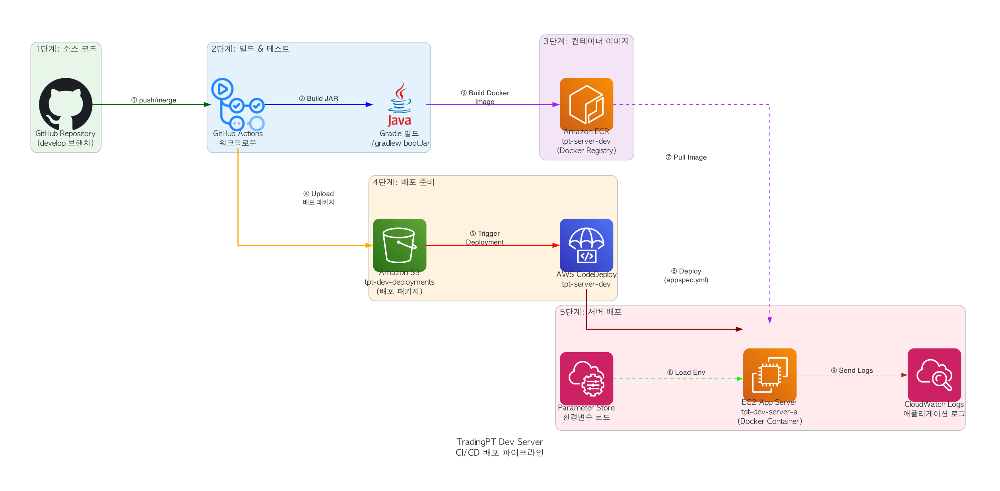

# Architecture Diagrams

## Production Infrastructure

Multi-AZ VPC architecture with Application Load Balancer, EC2 instances, RDS (MySQL), ElastiCache (Redis), S3, and CloudFront CDN.

**What to look for:**
- VPC subnet isolation (public/private)
- ALB SSL termination and routing
- Redis session clustering for stateless application tier
- S3 + CloudFront for static asset delivery
- RDS Multi-AZ failover configuration

## CI/CD Pipeline

GitHub Actions workflow with AWS CodeDeploy Blue/Green deployment strategy.

**What to look for:**
- Branch-based deployment triggers
- Build and test stages
- Blue/Green deployment for zero-downtime releases
- Health check verification after deployment
